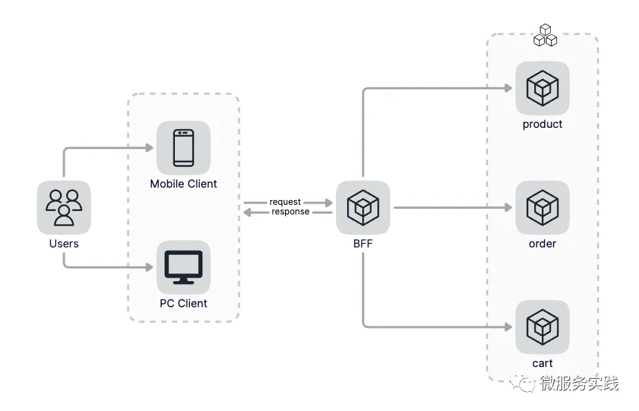

  `本项目跟随大佬教程编写一个基于go-zero的高并发的电商在线商城项目`

  1. 项目主要实现功能

       
  
     1. `BFF层`
         >   对于一个复杂的高并发的系统来说，我们需要处理各种异常的场景，比如某个页面需要依赖多个微服务提供的数据，为了避免串行请求导致的耗时过长，我们一般会并行的请求多个微服务，这个时候其中的某个服务请求异常的话我们可能需要做一些特殊的处理，比如提供一些降级的数据等。
         
         >   还有我们的页面展示的数据往往都是面向业务功能的，而不是单单某一个微服务的数据，这时候我们往往需要组装多个微服务的数据来满足需求，如果我们每个微服务都直接对外提供HTTP接口的话，那么这些复杂的数据组装和异常处理等工作只能由客户端来完成。众所周知客户端是不宜做复杂的业务逻辑的，客户端的重点应该更多是做交互体验上的优化，我们的整体架构需要做到前轻后重，即客户端逻辑尽量少而把比较重的业务处理逻辑下沉到服务端，而服务端又根据业务职能拆分成了不同的微服务，这些微服务只关注单一的业务，那么这些面向业务场景的复杂逻辑的处理应该放到哪里呢？我们的解决方案就是加一层，即BFF层，通过BFF对外提供HTTP接口，客户端只与BFF进行交互。
         
         
         
         > 可以提供多个BFF吗？答案是当然可以。BFF的目的是为客户端提供一个集中的接口，例如移动端页面和浏览器页面的数据协议不同，这种情况下为了更好的表示数据，可以使用两个BFF，同时只供一个BFF如果该BFF异常就会导致所有的业务受影响，提供多个BFF也可以提高服务的可用性，降低业务异常的影响面。多个BFF架构图如下：
         
2. 项目工程结构
    ```bash
    ## windows 带有的tree.com命令
    $ tree.com goZeroShopMall/
    goZeroShopMall
    ├─.idea
    ├─apps
    │  ├─app
    │  ├─cart
    │  ├─order
    │  ├─pay
    │  ├─product
    │  ├─recommend
    │  ├─reply
    │  └─user
    ├─imgs
    └─pkg
    ```
   apps目录存放所有的微服务，pkg目录为所有服务共同依赖包的存放路径（比如所有的服务都需要依赖鉴权就可以放到pkg目录下）
   - app - BFF服务
   - cart - 购物车服务 
   - order - 订单服务 
   - pay - 支付服务 
   - product - 商品服务 
   - recommend - 推荐服务 
   - reply - 评论服务 
   - user - 账号服务
   
   在每个服务目录下又会分为多个服务，主要会有如下几类服务：
   - api - 对外的BFF服务，接受来自客户端的请求，暴露HTTP接口
   - rpc - 对内的微服务，仅接受来自内部其他微服务或者BFF的请求，暴露gRPC接口
   - rmq - 负责进行流式任务处理，上游一般依赖消息队列，比如kafka等
   - admin - 也是对内的服务，区别于rpc，更多的是面向运营侧的且数据权限较高，通过隔离可带来更好的代码级别的安全，直接提供HTTP接口
   
   ```bash
   $ tree.com goZeroShopMall/
   goZeroShopMall
   ├─.idea
   ├─apps
   │  ├─app
   │  │  └─api
   │  ├─cart
   │  │  ├─admin
   │  │  ├─rmq
   │  │  └─rpc
   │  ├─order
   │  │  ├─admin
   │  │  ├─rmq
   │  │  └─rpc
   │  ├─pay
   │  │  ├─admin
   │  │  ├─rmq
   │  │  └─rpc
   │  ├─product
   │  │  ├─admin
   │  │  ├─rmq
   │  │  └─rpc
   │  ├─recommend
   │  │  └─rpc
   │  ├─reply
   │  │  ├─admin
   │  │  ├─rmq
   │  │  └─rpc
   │  └─user
   │      ├─admin
   │      ├─rmq
   │      └─rpc
   ├─imgs
   └─pkg
   ```
   大多服务都会拆分成rpc、rmq和admin来满足对内提供rpc接口和运营数据的需求，同时通过rmq来处理流式任务。比较特殊的是app下只有api服务，因为app是BFF只有api服务，后面可能会增加rmq服务，比如来流式处理用户每天首次登陆加经验之类的逻辑，后面可以随时扩展，暂时先只提供api服务。recommend只有rpc服务，因为推荐服务需要依赖AI团队或者大数据团队提供的数据，我们只需要请求对应的数据接口和做一些满足业务的处理即可，所以这里recommend只有rpc服务。

   ```bash
   # 其中 rpc 代码目录是由goctl命令初始化的
   $ cd goZeroShopMall/apps/order/
   $ goctl rpc new rpc
   $ tree.com 
   ├─admin
   ├─rmq
   └─rpc
      ├─etc
      ├─internal
      │  ├─config
      │  ├─logic
      │  ├─server
      │  └─svc
      ├─rpc
      └─rpcclient
   
   # 执行goctl命令初始化order admin代码，注意order admin为api服务，直接对前端提供HTTP接口
   $ goctl api new admin
   $ tree.com
   admin
   ├─etc
   └─internal
      ├─config
      ├─handler
      ├─logic
      ├─svc
      └─types
   # 生成的admin api服务代码可以直接运行，默认监听8888端口
   # rmq服务也会使用go-zero提供的kq功能，这里先初始化main.go
   $ ls rmq/
   main.go
   # 到这里order服务的代码初始化已经完成，其ta服务和order服务类似，不再赘述。
   # pkg目前不需要初始化，当我们需要提供业务通用功能的时候我们再进行添加。
   ```
参考链接:
1. [大佬微信公众号](https://mp.weixin.qq.com/s?__biz=Mzg2ODU1MTI0OA==&mid=2247485645&idx=1&sn=d329f56741dbe1f3e09713a6e4d1f7f0&chksm=ceabd7f2f9dc5ee4faa064ba8e0634f20afff6aae3ea3fb0d855029aac7cb23d0ab0a6901894&cur_album_id=1655138838454796294&scene=189#wechat_redirect)